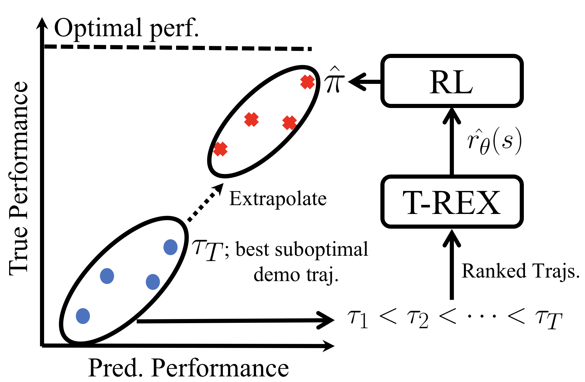

# Abstract

A critical flaw of existing inverse reinforcement learning (IRL) methods is their inability to significantly outperform the demonstrator.
This is because IRL typically seeks a reward function that makes the demonstrator appear near-optimal, rather than inferring the underlying intentions of the demonstrator that may have been poorly executed in practice.
In this paper, we introduce a novel reward-learning-from-observation algorithm, Trajectory-ranked Reward EXtrapolation (T-REX), that extrapolates beyond a set of (approximately) ranked demonstrations in order to infer high-quality reward functions from a set of potentially poor demonstrations. When combined with deep reinforcement learning, T-REX out-performs state-of-the-art imitation learning and IRL methods on multiple Atari and MuJoCo benchmark tasks, and can achieve performance that is sometimes more than an order of magnitude better than the best-performing demonstration.
Finally, we demonstrate that T-REX is robust to modest amounts of ranking noise and can accurately extrapolate intention by simply watching a learner noisily improve at a task over time.

# How does it work?

We model the problem as a binary classification probelm.

# Experimental Results

We conducted experiments with Mujoco locomotion tasks and Atari tasks.

## IRL Results -- Inferred Reward Functions

## Overall IRL-RL Results -- T-REX inferred reward function + PPO

## Policy Visualization in Cheetah

<video src="assets/paper/cheetah_45_demo_trimmed.mp4" width="320" height="320" controls preload></video>
<video src="assets/paper/cheetah_45_trex_trimmed.mp4" width="320" height="320" controls preload></video>
<video src="assets/paper/cheetah_60_demo_trimmed.mp4" width="320" height="320" controls preload></video>
<video src="assets/paper/cheetah_60_trex_trimmed.mp4" width="320" height="320" controls preload></video>
<video src="assets/paper/cheetah_120_demo_trimmed.mp4" width="320" height="320" controls preload></video>
<video src="assets/paper/cheetah_120_demo_trimmed.mp4" width="320" height="320" controls preload></video>

   
